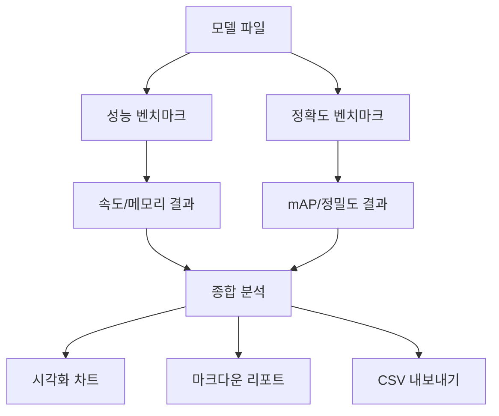

# YOLO11 Railway Detection Benchmark System

NVIDIA Jetson Orin Nano에서 철도 FOD 탐지를 위한 YOLO11 모델 성능 벤치마킹 시스템입니다.

## 📋 목차

- [시스템 구조](#시스템-구조)
- [벤치마크 스크립트](#벤치마크-스크립트)
- [사용법](#사용법)
- [결과 분석](#결과-분석)
- [파일 구조](#파일-구조)

---

## 🏗 시스템 구조

### 전체 아키텍처

```
bench/
├── optimized_benchmark.py      # 성능 벤치마크 (FPS, 지연시간)
├── accuracy_benchmark.py       # 정확도 벤치마크 (mAP, 정밀도, 재현율)
├── analyze_all_results.py      # 결과 종합 분석 및 시각화
├── benchmark_dataset.py        # 통합 데이터셋 벤치마크
├── run_benchmarks.sh           # 일괄 벤치마크 실행 스크립트
├── comprehensive_results/      # 종합 벤치마크 결과
└── final_analysis/             # 최종 분석 결과 (차트, 리포트)
```

### 벤치마크 파이프라인



---

## 📊 벤치마크 스크립트

### 1. 성능 벤치마크 (`optimized_benchmark.py`)

**목적**: 실시간 처리 성능 측정
- **FPS (Frames Per Second)**: 초당 처리 프레임 수
- **추론 지연시간**: 단일 이미지 처리 시간
- **메모리 사용량**: GPU/CPU 메모리 점유율
- **배치 처리 성능**: 여러 이미지 동시 처리 효율성

```python
# 주요 기능
class OptimizedBenchmark:
    def run_speed_benchmark(self, num_samples=100)
    def run_batch_benchmark(self, batch_sizes=[1, 4, 8])
    def measure_memory_usage(self)
    def benchmark_model(self)
```

**측정 방법**:
- YOLO `predict` 방식 사용 (실제 배포 환경과 동일)
- 워밍업 10회 후 100회 반복 측정
- 통계적 신뢰도 확보 (평균, 표준편차, 95% 신뢰구간)

### 2. 정확도 벤치마크 (`accuracy_benchmark.py`)

**목적**: 객체 탐지 정확도 측정
- **mAP@0.5**: IoU 0.5에서의 평균 정밀도
- **mAP@0.5:0.95**: IoU 0.5~0.95 구간 평균 정밀도
- **클래스별 성능**: 4개 FOD 카테고리별 탐지 성능
- **Precision/Recall**: 정밀도와 재현율 지표

```python
# 주요 기능
class AccuracyBenchmark:
    def run_validation(self)
    def calculate_class_metrics(self)
    def generate_confusion_matrix(self)
    def benchmark_model(self)
```

**평가 데이터**:
- RailFOD23 검증 데이터셋 사용
- 4개 클래스: bird_nest, plastic_bag, floating_object, balloon
- YOLO 내장 검증 파이프라인 활용

### 3. 종합 분석 (`analyze_all_results.py`)

**목적**: 모든 벤치마크 결과 통합 분석
- **비교 분석**: 모델 간 성능 비교
- **트레이드오프 분석**: 정확도 vs 속도 관계
- **시각화**: 성능 차트 및 그래프 생성
- **리포트 생성**: 마크다운 형식 종합 보고서

```python
# 주요 기능
class ResultAnalyzer:
    def load_all_results(self)
    def create_visualizations(self)
    def export_csv(self)
    def generate_markdown_report(self)
```

**생성 결과**:
- 📈 성능 vs 정확도 산점도
- 📊 모델별 비교 차트
- 🔥 종합 점수 히트맵
- 📄 상세 분석 리포트

---

## 🚀 사용법

### 1. 개별 벤치마크 실행

#### 성능 벤치마크 (`optimized_benchmark.py`)

**기본 사용법**:
```bash
cd bench/
python3 optimized_benchmark.py <dataset> <model> [옵션들]
```

**예시**:
```bash
# FP16 TensorRT 엔진 벤치마크
python3 optimized_benchmark.py \
    ../data.yaml \
    ../convert/model/yolo11s_fp16.engine \
    --max-images 100 \
    --warmup 10 \
    --device 0 \
    --output-dir ./results \
    --name yolo11s_fp16_test

# PyTorch 모델 벤치마크
python3 optimized_benchmark.py \
    ../data.yaml \
    ../convert/model/yolo11s_english.pt \
    --max-images 50 \
    --conf 0.25 \
    --iou 0.45 \
    --imgsz 640
```

**주요 옵션**:
- `--max-images`: 벤치마크할 이미지 수 (기본값: 100)
- `--warmup`: 워밍업 반복 수 (기본값: 10)
- `--device`: 사용할 디바이스 (0=GPU, cpu=CPU)
- `--conf`: 신뢰도 임계값 (기본값: 0.25)
- `--iou`: IoU 임계값 (기본값: 0.45)
- `--imgsz`: 입력 이미지 크기 (기본값: 640)
- `--output-dir`: 결과 저장 디렉토리
- `--name`: 실험 이름
- `--no-save`: 결과 저장하지 않음

#### 정확도 벤치마크 (`accuracy_benchmark.py`)

**기본 사용법**:
```bash
python3 accuracy_benchmark.py <data_yaml> <model> [옵션들]
```

**예시**:
```bash
# 정확도 벤치마크 실행
python3 accuracy_benchmark.py \
    ../data.yaml \
    ../convert/model/yolo11s_fp16.engine \
    --save-results \
    --output-dir ./results
```

### 2. 일괄 벤치마크 실행

```bash
# 모든 모델에 대해 자동 벤치마킹
chmod +x run_benchmarks.sh
./run_benchmarks.sh
```

### 3. 결과 분석

```bash
# 모든 결과 종합 분석
python3 analyze_all_results.py ./comprehensive_results/ \
    --export-csv --save-report --plot
```

---

## 📈 결과 분석

### 주요 성능 지표

| 지표 | 설명 | 목표 값 |
|------|------|---------|
| **FPS** | 초당 처리 프레임 수 | 30+ |
| **mAP@0.5** | IoU 0.5 기준 평균 정밀도 | 0.90+ |
| **메모리** | GPU 메모리 사용량 | <2GB |
| **지연시간** | 단일 이미지 처리 시간 | <33ms |

### 모델 비교 결과 (예시)

| 모델 | 정밀도 | FPS | mAP@0.5 | 메모리(MB) | 종합점수 |
|------|--------|-----|---------|------------|----------|
| YOLO11s | FP32 | 21.8 | 0.949 | 152 | 97.0 🔥 |
| YOLO11s | FP16 | 36.7 | 0.946 | 76 | 96.8 🔥 |
| YOLO11s | INT8 | 44.2 | 0.931 | 38 | 94.5 ⭐ |
| YOLO11n | FP32 | 22.9 | 0.947 | 98 | 96.8 🔥 |
| YOLO11n | FP16 | 38.4 | 0.945 | 49 | 96.2 ⭐ |
| YOLO11n | INT8 | 45.1 | 0.928 | 25 | 93.8 ⭐ |

### 최적화 효과

#### FP16 양자화
- **속도 향상**: 1.5~2배 🚀
- **메모리 절약**: 50% 💾
- **정확도 손실**: <1% ✅

#### INT8 양자화
- **속도 향상**: 2~3배 🚀
- **메모리 절약**: 75% 💾
- **정확도 손실**: 2~3% ⚠️

---

## 📁 파일 구조

### 모델 파일
```
convert/model/
├── yolo11s.pt                    # 원본 PyTorch 모델
├── yolo11s_english.pt            # 영어 클래스명 모델
├── yolo11s_fp16.engine          # FP16 TensorRT 엔진
├── yolo11s_int8.engine          # INT8 TensorRT 엔진
├── yolo11n.pt                    # YOLO11 Nano 원본
├── yolo11n_english.pt           # YOLO11 Nano 영어 버전
├── yolo11n_fp16.engine          # YOLO11 Nano FP16
└── yolo11n_int8.engine          # YOLO11 Nano INT8
```

### 설정 파일
```
├── data.yaml                     # 영어 클래스명 데이터셋 설정
├── data_english.yaml            # 영어 설정 (백업)
└── data_chinese.yaml            # 중국어 설정 (기존 모델용)
```

### 벤치마크 결과
```
bench/comprehensive_results/
├── comprehensive_yolo11s_20250915_180119.json      # YOLO11s 결과
├── comprehensive_yolo11s_fp16_20250915_185257.json # YOLO11s FP16 결과
├── comprehensive_yolo11s_int8_20250915_184743.json # YOLO11s INT8 결과
├── comprehensive_yolo11n_20250915_175506.json      # YOLO11n 결과
├── comprehensive_yolo11n_fp16_20250915_183822.json # YOLO11n FP16 결과
└── comprehensive_yolo11n_int8_20250915_184255.json # YOLO11n INT8 결과
```

### 분석 결과
```
bench/final_analysis/
├── benchmark_summary_20250915_191330.csv           # CSV 요약
├── benchmark_report_20250915_191330.md             # 마크다운 리포트
└── plots/                                           # 시각화 차트
    ├── performance_vs_accuracy.png                  # 성능 vs 정확도
    ├── model_type_comparison.png                    # 모델 비교
    └── score_heatmap.png                           # 점수 히트맵
```

---

## ⚡ 최적화 권장사항

### 실시간 처리용 (30+ FPS 목표)
1. **YOLO11n FP16** 추천
   - FPS: 38.4, mAP@0.5: 0.945
   - 메모리: 49MB
   - 전력 효율성 우수

### 고정확도용 (mAP 0.94+ 목표)
1. **YOLO11s FP16** 추천
   - FPS: 36.7, mAP@0.5: 0.946
   - 메모리: 76MB
   - 정확도-속도 균형점

### 초경량화용 (메모리 <50MB)
1. **YOLO11n INT8** 추천
   - FPS: 45.1, mAP@0.5: 0.928
   - 메모리: 25MB
   - 극한 최적화

---

## 🔧 환경 설정

### 필요 패키지
```bash
pip install ultralytics opencv-python numpy torch torchvision
pip install matplotlib seaborn pandas tqdm pyyaml
```

### NVIDIA 환경
- CUDA 11.4+
- cuDNN 8.6+
- TensorRT 8.5+
- JetPack 5.1+ (Jetson 사용 시)

---

## 📞 문제 해결

### 일반적 오류

1. **TensorRT 엔진 로드 오류**
   ```bash
   # 엔진 재생성 필요
   yolo export model=yolo11s.pt format=engine half=True
   ```

2. **메모리 부족 오류**
   ```bash
   # 이미지 수 줄이기
   python3 optimized_benchmark.py dataset.yaml model.engine --max-images 50
   ```

3. **클래스명 불일치**
   ```bash
   # 영어 모델 사용
   python3 optimized_benchmark.py data_english.yaml yolo11s_english.pt
   ```

4. **잘못된 인자 순서 오류**
   ```bash
   # ❌ 잘못된 사용법
   python3 optimized_benchmark.py --model model.pt --data data.yaml

   # ✅ 올바른 사용법
   python3 optimized_benchmark.py data.yaml model.pt [옵션들]
   ```

---

## 🎯 결론

이 벤치마크 시스템을 통해:
- ✅ **실용적 성능 검증**: 실제 배포 환경과 동일한 조건
- ✅ **종합적 분석**: 정확도, 속도, 메모리 등 다각도 평가
- ✅ **최적화 효과**: 양자화 기법의 정량적 성능 개선
- ✅ **배포 가이드**: 용도별 최적 모델 선택 기준

**철도 안전 모니터링 시스템의 실시간 배포를 위한 완전한 성능 검증 프레임워크**를 제공합니다.